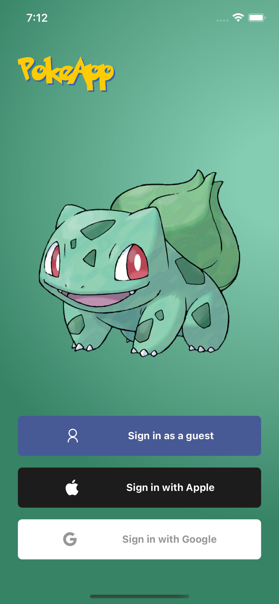
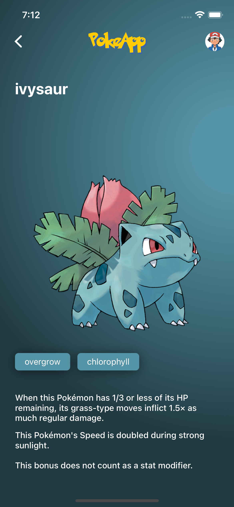
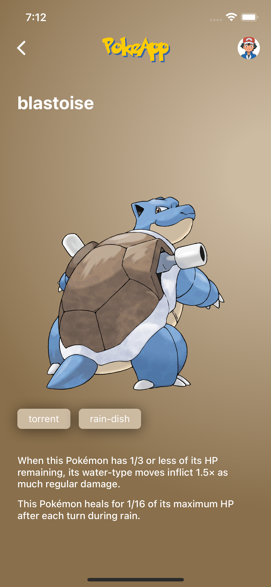

<h1 align="center">
PokeApp
</h1>
<p align="center">
    <a href="https://github.com/marlonbelomarques/pokeapp">
    
  </a>
</p>
<p align="center">
  <a href="https://github.com/MarlonBeloMarques">
    
  </a>
</p>

Get access to a huge list of pokemons with images and characteristics and the best thing is, after loading the pokemons you don't need internet anymore to see your pokemons.

----

<p align="center">
    
    
    
</p>

----

This README will cover a little about the main tools used as well as running PokeApp locally.

* Prerequisites
* Configuration
* Build
* Deploy
* Contact

----
## Prerequisites

If you have no idea how to install React Native and run it locally, check this *[Get started](https://archive.reactnative.dev/docs/getting-started)*.

### Firebase

PokeApp uses Firebase Analytics, Crashlytics and Auth, if you have no idea how to create a Firebase account and configure it, *[Start here](https://rnfirebase.io/)*.

### CodePush

For you to configure Code Push you will need to create an account and configure your environment, to help you, you can *[Start here](https://docs.microsoft.com/en-us/appcenter/distribution/codepush/)*.

### Fastlane

To make the publishing and authoring process easier, you will need to set up your environment, check *[these steps](https://www.cloudbees.com/blog/react-native-developer-series-ios-and-android-fastlane-setup-and-certificates)*.

## Configuration
#### If you've gone through the prerequisites phase, then it's almost all ready, we just need to reinforce that it's all set up.

After creating project in firebase console, make sure you have added authentication with google and apple.

### Android

Before configuring your environment, you must have configured your project in firebase console for android, if you did, for android in specific you need to add a HASH key in your configuration in firebase to be able to login.

Navigate to the project root and run:
````
cd android && ./gradlew signingReport
````
This will generate the application's signing certificate.

Make sure you are copying SHA1 from Task **:app:signingReporte** not from any other Task.

With this key, you should add your configuration in firebase console. Now yes!

- In your project's Firebase Console, download the `google-services.json` file and add it to the root of the **android/app** folder.
- Check the `.env.development` and `.env.production` files and add **WEB_CLIENT_ID_GOOGLE_ANDROID** add your **client_id** which can be found in `google-services.json`, get the one from client_type: 3 .
- With the CodePush key in hand, add it into your `MainApplication.java` in the android `/app/src/main/java/com/marlonmarques/pokeapp` folder, where you have **your-key**
- To login with apple on android, you will need an apple developer account, to create a service to login. you can find more details [here](https://help.apple.com/developer-account/#/dev1c0e25352), if you did everything right, you should get a **clientId** and a **redirectUri**, add them to `src/screens/Login/index.tsx` and look for **your-client-id** and **your-redirectUri**.

### IOS

- In your project's Firebase Console, download the `GoogleService-Info.plist` file and add it to the root of the **ios** folder.
- Check the `.env.development` and `.env.production` files and add in **WEB_CLIENT_ID_GOOGLE_IOS** add your **key** which can be found in `GoogleService-Info.plist`.
- Still in `GoogleService-Info.plist`, get the key **REVERSED_CLIENT_ID** and add it to `Info.plist` in the **URL Types** area, in the **URL Schemes** field.
- With the CodePush key in hand, add inside your `Info.plist` a new key named **CodePushDeploymentKey** and the key you got.

One hint, if you want to see the data stored in the database, download the [Realm for Desktop](https://docs.mongodb.com/realm-legacy/products/realm-studio/index.html) to get access the route from your database, you will need to access the Home screen in the app, after Login. In the LOG's you must observe the access route to your database. So just run it on your terminal, for example:

```bash
open /Users/marlonmarques/Library/Developer/CoreSimulator/Devices/6953DC7D-B154-4996-9475-B545537AB84A/data/Containers/Data/Application/7A3BFF9F-76C0-4A30-9F7A-45DFDF4AF707/Documents/default.realm
```

- Only valid for IOS, for android it will need a searched google 🧐.

Reinforcing what was done during the prerequisites, you should be able to configure your project without any problems.

## Build

To run the project in your environment, just do the following:
````
yarn
````
- To download dependencies

Depending on the platform you want to test, just run according to the name of the platform, in the case of android you must first open the emulator.
````
yarn android
````
````
yarn ios
````
## Deploy

### Fastlane
To make the construction and distribution, through the fast lane became easier. If you passed the prerequisites. must have seen something about *[fastlane match](https://docs.fastlane.tools/actions/match/)* and also *[fastlane supply](https://docs.fastlane.tools/actions/supply/)*.

For everything to work out, it is very important that you configure these steps, so that everything works out both on android and ios.

### Android

You can use the traditional way to build PokeApp or run the following command:
````
fastlane android deploy
````
Deploy a new version to the Google Play

````
fastlane android beta
````
Submit a new Beta Build to Crashlytics Beta

### IOS

You can use the traditional way to build PokeApp or run the following command:
````
fastlane ios release
````
Push a new release build to the App Store

````
fastlane ios beta
````
Push a new beta build to TestFlight

### CodePush

Now if you just want to push up a quick code level change with CodePush, that's no mystery. If you configured for Android or IOS. Just run the code according to the version and platform set.

````
appcenter codepush release-react -t "1.0.0" Production
````

## Contact

You still have any doubts, or need to talk to me, you can find me here:

- Instagram: [@marlomarquesbr](https://www.instagram.com/marlonmarqsbr/)
- Linkedin: [Marlon Marques](https://www.linkedin.com/in/marlon-marques-0b509813b/)
